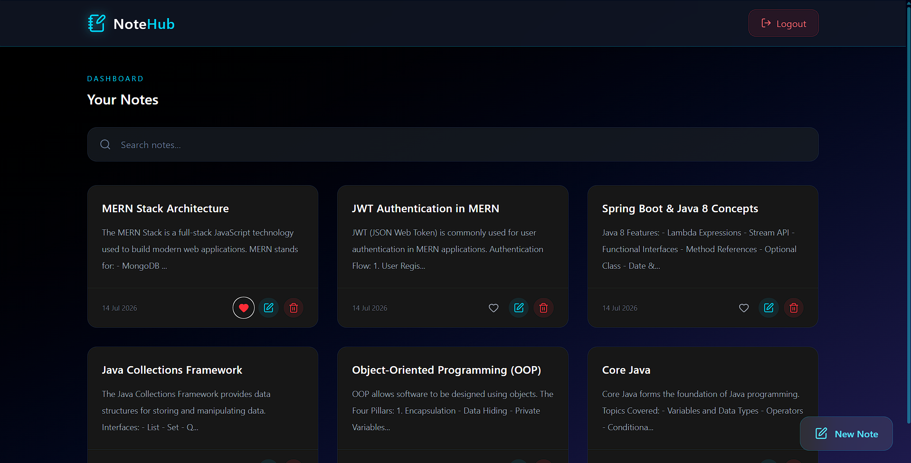

# 📝 NoteHub

> 🚀 A modern full-stack Notes Management application built with the MERN Stack to demonstrate secure authentication, CRUD operations, and responsive UI design.

[](https://note-hub-five.vercel.app)

---

## 🌐 Live Demo

👉 **https://note-hub-five.vercel.app**

---

## 📖 About

**NoteHub** is a modern full-stack Notes Management application built using the **MERN Stack**. It enables users to securely register, log in, and manage their personal notes through a clean, responsive, and intuitive interface.

The application implements **JWT Authentication**, complete **CRUD operations**, **real-time search**, **favorite notes**, and a modern dark-themed UI, making it an excellent portfolio project demonstrating full-stack web development concepts.

---

## ✨ Features

- 🔐 JWT Authentication & Authorization
- 👤 Secure User Registration & Login
- 📝 Create, Read, Update & Delete Notes
- 🔍 Real-time Search Notes
- ❤️ Favorite / Unfavorite Notes
- 📄 View Full Note
- 🔒 Protected Routes
- 📱 Fully Responsive Design
- 🌙 Modern Dark UI
- 🔔 Beautiful Toast Notifications
- ☁️ MongoDB Atlas Database
- ⚡ Fast API using Express.js

---

## 🖼️ Screenshots

### Login Page

> _(Add login screenshot here)_

### Home Page



---

## 🛠️ Tech Stack

### Frontend

- React.js
- Vite
- Tailwind CSS
- React Router DOM
- Axios
- React Hot Toast
- Lucide React

### Backend

- Node.js
- Express.js
- MongoDB Atlas
- Mongoose
- JWT (JSON Web Token)
- bcryptjs

### Development Tools

- Git
- GitHub
- VS Code
- Postman
- Render
- Vercel

---

## 📂 Project Structure

```text
NoteHub
│
├── Backend
│   ├── config
│   ├── controllers
│   ├── middleware
│   ├── models
│   ├── routes
│   ├── utils
│   ├── package.json
│   └── server.js
│
├── Frontend
│   ├── public
│   ├── src
│   │   ├── components
│   │   ├── context
│   │   ├── pages
│   │   ├── services
│   │   ├── utils
│   │   └── App.jsx
│   ├── package.json
│   └── vite.config.js
│
├── screenshots
│   └── homepage.png
│
├── README.md
└── .gitignore
```

---

# 🚀 Getting Started

## 1️⃣ Clone the Repository

```bash
git clone https://github.com/J-MOHAMEDTHARIK/NoteHub.git
```

## 2️⃣ Navigate to the Project

```bash
cd NoteHub
```

---

# ⚙️ Backend Setup

```bash
cd Backend
npm install
npm start
```

Backend runs at

```text
http://localhost:5000
```

---

# 💻 Frontend Setup

Open another terminal.

```bash
cd Frontend
npm install
npm run dev
```

Frontend runs at

```text
http://localhost:5173
```

---

# 🔑 Environment Variables

Create a **.env** file inside the **Backend** folder.

```env
PORT=5000

MONGO_URI=your_mongodb_connection_string

JWT_SECRET=your_secret_key
```

---

# 📌 REST API

## Authentication

| Method | Endpoint             | Description   |
| ------ | -------------------- | ------------- |
| POST   | `/api/auth/register` | Register User |
| POST   | `/api/auth/login`    | Login User    |

---

## Notes

| Method | Endpoint                  | Description     |
| ------ | ------------------------- | --------------- |
| GET    | `/api/notes`              | Get All Notes   |
| GET    | `/api/notes/:id`          | Get Single Note |
| POST   | `/api/notes`              | Create Note     |
| PUT    | `/api/notes/:id`          | Update Note     |
| DELETE | `/api/notes/:id`          | Delete Note     |
| PATCH  | `/api/notes/:id/favorite` | Toggle Favorite |

---

# 🎯 Future Improvements

- 📤 Share Notes
- 🔐 Forgot Password (OTP via Email)
- 📂 Categories & Tags
- 📌 Pin Notes
- 🖼️ Image Attachments
- 📄 Export Notes as PDF
- 📅 Reminder Notifications
- 🤖 AI-powered Note Summary
- 🌙 Light Theme
- 📱 Progressive Web App (PWA)

---

# 🚀 Deployment

### Frontend

- **Vercel**

### Backend

- **Render**

### Database

- **MongoDB Atlas**

---

# 👨‍💻 Author

## Mohamed Tharik

### 🌐 Portfolio

https://tharik-portfolio-ecru.vercel.app/

### 💼 LinkedIn

https://www.linkedin.com/in/mohamed-tharik--j/

### 🐙 GitHub

https://github.com/J-MOHAMEDTHARIK

---

# 🤝 Contributing

Contributions, issues, and feature requests are welcome.

If you'd like to contribute:

1. Fork this repository
2. Create a feature branch
3. Commit your changes
4. Push your branch
5. Open a Pull Request

---

# ⭐ Support

If you found this project helpful, please consider giving it a ⭐ on GitHub.

It motivates me to build more open-source projects and helps others discover this repository.

---

## 💙 Thank You for Visiting NoteHub!

If you like this project, don't forget to ⭐ the repository and share it with others.
